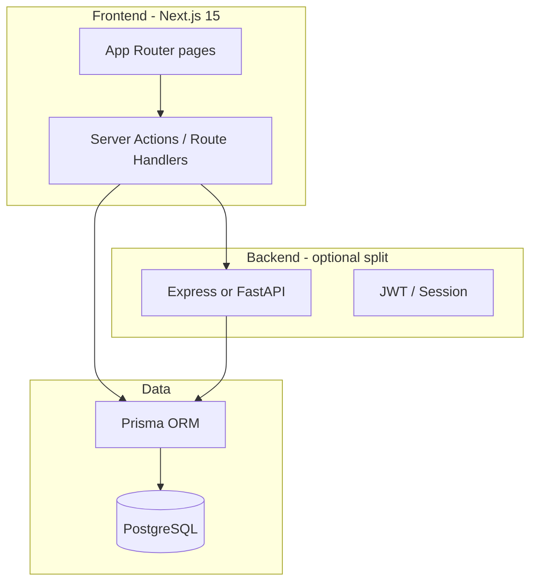

# Day 18 — Capstone Guide: TrackStack

> This is your exam day. Read this once in the morning, then build.

## What you're proving

You can architect, implement, debug, and deploy a multi-tenant SaaS app **without tutorials** — using docs and your own past projects as reference (after hour 4).

---

## Recommended architecture



**Option A (faster):** Next.js full-stack — Prisma + server actions (like Day 14).  
**Option B (stronger resume):** Next.js frontend + separate Express/FastAPI API.

Pick one and document why in the README.

---

## Data model (core entities)

```
User ──< Member >── Workspace ──< Project ──< Task
```

- **User** — auth identity
- **Workspace** — tenant boundary (team)
- **Member** — join table with role (`OWNER` | `MEMBER`)
- **Project** — belongs to workspace
- **Task** — belongs to project; status, priority, assignee, due date

See `project/trackstack/prisma/schema.prisma` for starter schema.

---

## Build phases (hour-by-hour)

| Hour | Focus | Deliverable |
|------|-------|-------------|
| 0–1 | Schema + auth | Prisma migrate, register/login working |
| 1–2 | Workspaces + members | Create workspace, invite member, RBAC |
| 2–4 | Projects + tasks CRUD | API or server actions, Zod validation |
| 4–6 | Kanban or table view | Drag status OR filterable table |
| 6–8 | Dashboard stats + chart | recharts — tasks completed per day |
| 8–10 | Polish | shadcn, dark mode, toasts, skeletons, empty states |
| 10–12 | Search + pagination | Tasks list scales |
| 12–13 | Activity feed | Recent task updates |
| 13–14 | Deploy | Live URL on Vercel + Neon/Railway |
| 14–15 | README + voice memo | Architecture doc + interview answers |

---

## Hour 0–4 rules (solo mode)

- NO opening old project folders
- NO asking AI for code
- Allowed: MDN, Next.js docs, Prisma docs, shadcn docs, recharts docs
- Allowed: fixing env/dependency errors

After hour 4: your Days 6–17 projects are your reference library.

---

## Minimum viable capstone (if time runs out)

Priority order if you must cut scope:

1. Auth + one workspace + tasks CRUD
2. Dashboard with one stat card
3. Deploy with README
4. Kanban / chart / activity feed (add if time)

---

## Deployment checklist

- [ ] `DATABASE_URL` on host (Neon, Supabase, Railway Postgres)
- [ ] `NEXTAUTH_SECRET` or `JWT_SECRET` set
- [ ] Prisma migrate on deploy
- [ ] CORS / auth cookie domain correct
- [ ] README has live URL + setup steps

---

## Final interview drill (record yourself)

1. Walk through your architecture.
2. How does auth work?
3. How did you model workspaces and members?
4. What breaks at 100k users? How would you fix it?
5. Hardest bug today — how did you debug it?

If you answer smoothly → start `../dsa-java-plan/PLAN.md` tomorrow.
